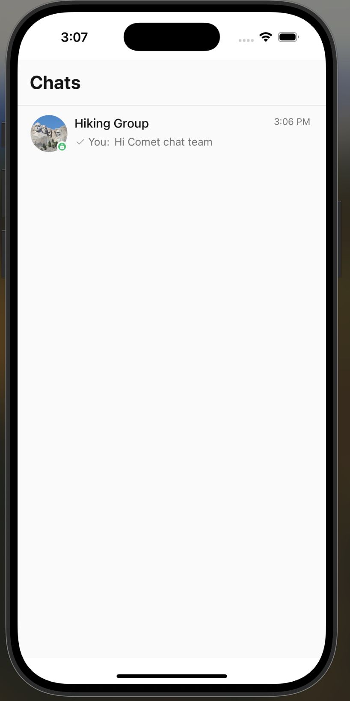
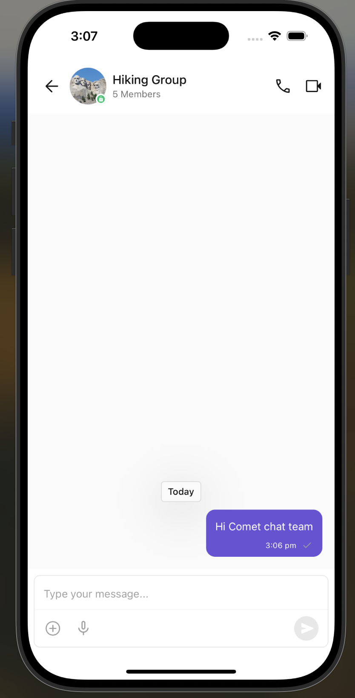

## Screenshots
  

## ✅  Challenges Faced

1. **Expo Go Limitation**
   - Initially attempted to test using Expo Go, but the CometChat SDK failed to work due to native module restrictions.
   - ✅ *Solved* by switching to React Native CLI and running the app on the iOS Simulator using Xcode.

2. **Manual User UID Setup**
   - CometChat required manually creating a UID (`cometchat-uid-1`) via the dashboard, which wasn’t automated or documented in a beginner-friendly way.
   - ✅ *Solved* by logging into the CometChat Dashboard and creating the user under the “Users” section.

3. **Native Linking & Pod Setup**
   - Faced issues running `pod install` and resolving native module linking during the CometChat SDK setup.
   - ✅ *Solved* by re-installing dependencies, running `npx pod-install`, and cleaning Xcode build cache.

4. **SDK Initialization Confusion**
   - The CometChat documentation didn’t clearly specify where to place `CometChat.init()` and login logic.
   - ✅ *Solved* by moving initialization into `useEffect()` inside the main screen component (`index.jsx`).

---

## ✅ Suggestions to Improve CometChat UI Kit

- **Provide Expo CLI and React Native CLI specific docs separately**
  > It can be confusing for beginners to know which setup supports native modules.

- **Add automatic user creation or login fallback**
  > Currently, the user must be created manually. Supporting guest login or signup would greatly help.

- **Improve customizability of `<CometChatUI />`**
  > It works great, but theming or UI overrides (colors, layout, fonts) would help in real-world integration.

- **Show clearer error messages**
  > Login or init failures should display UI errors, not just console logs.

---


This is a new [**React Native**](https://reactnative.dev) project, bootstrapped using [`@react-native-community/cli`](https://github.com/react-native-community/cli).


# Getting Started

> **Note**: Make sure you have completed the [Set Up Your Environment](https://reactnative.dev/docs/set-up-your-environment) guide before proceeding.

## Step 1: Start Metro

First, you will need to run **Metro**, the JavaScript build tool for React Native.

To start the Metro dev server, run the following command from the root of your React Native project:

```sh
# Using npm
npm start

# OR using Yarn
yarn start
```

## Step 2: Build and run your app

With Metro running, open a new terminal window/pane from the root of your React Native project, and use one of the following commands to build and run your Android or iOS app:

### Android

```sh
# Using npm
npm run android

# OR using Yarn
yarn android
```

### iOS

For iOS, remember to install CocoaPods dependencies (this only needs to be run on first clone or after updating native deps).

The first time you create a new project, run the Ruby bundler to install CocoaPods itself:

```sh
bundle install
```

Then, and every time you update your native dependencies, run:

```sh
bundle exec pod install
```

For more information, please visit [CocoaPods Getting Started guide](https://guides.cocoapods.org/using/getting-started.html).

```sh
# Using npm
npm run ios

# OR using Yarn
yarn ios
```

If everything is set up correctly, you should see your new app running in the Android Emulator, iOS Simulator, or your connected device.

This is one way to run your app — you can also build it directly from Android Studio or Xcode.

## Step 3: Modify your app

Now that you have successfully run the app, let's make changes!

Open `App.tsx` in your text editor of choice and make some changes. When you save, your app will automatically update and reflect these changes — this is powered by [Fast Refresh](https://reactnative.dev/docs/fast-refresh).

When you want to forcefully reload, for example to reset the state of your app, you can perform a full reload:

- **Android**: Press the <kbd>R</kbd> key twice or select **"Reload"** from the **Dev Menu**, accessed via <kbd>Ctrl</kbd> + <kbd>M</kbd> (Windows/Linux) or <kbd>Cmd ⌘</kbd> + <kbd>M</kbd> (macOS).
- **iOS**: Press <kbd>R</kbd> in iOS Simulator.

## Congratulations! :tada:

You've successfully run and modified your React Native App. :partying_face:

### Now what?

- If you want to add this new React Native code to an existing application, check out the [Integration guide](https://reactnative.dev/docs/integration-with-existing-apps).
- If you're curious to learn more about React Native, check out the [docs](https://reactnative.dev/docs/getting-started).

# Troubleshooting

If you're having issues getting the above steps to work, see the [Troubleshooting](https://reactnative.dev/docs/troubleshooting) page.

# Learn More

To learn more about React Native, take a look at the following resources:

- [React Native Website](https://reactnative.dev) - learn more about React Native.
- [Getting Started](https://reactnative.dev/docs/environment-setup) - an **overview** of React Native and how setup your environment.
- [Learn the Basics](https://reactnative.dev/docs/getting-started) - a **guided tour** of the React Native **basics**.
- [Blog](https://reactnative.dev/blog) - read the latest official React Native **Blog** posts.
- [`@facebook/react-native`](https://github.com/facebook/react-native) - the Open Source; GitHub **repository** for React Native.

